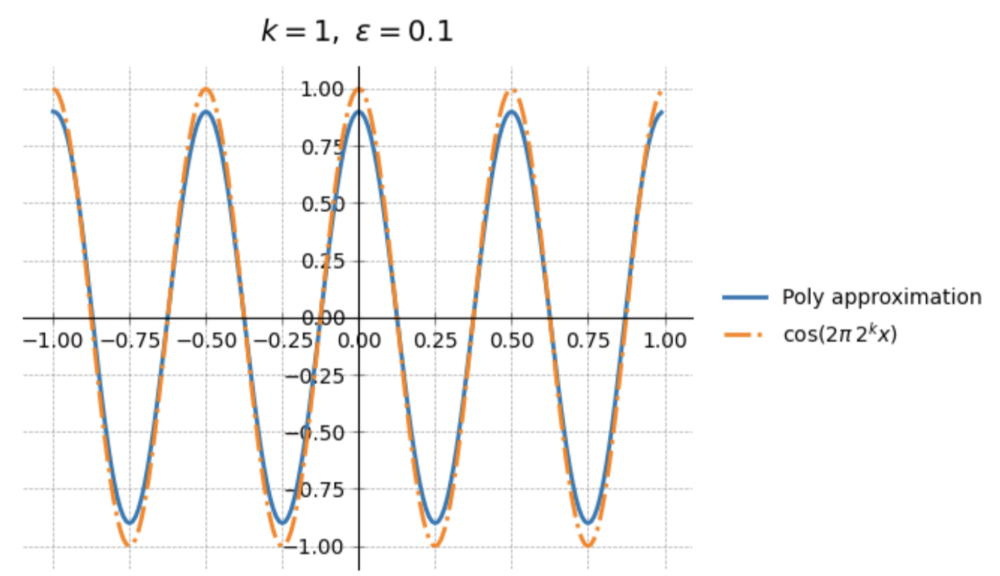

This dataset contains phase angles to approximate the function $cos(x)$ via [Quantum Signal Processing (QSP)](https://pennylane.ai/qml/demos/function_fitting_qsp) and [Quantum Singular Value Transformation (QSVT)](https://pennylane.ai/qml/demos/tutorial_intro_qsvt).

**Description of the dataset**

QSVT and QSP are powerful quantum algorithms that implement a large class of polynomial transformations. However, many of the operators in these algorithms depend on a series of phase angles that correspond to the desired polynomial. While calculating these angles can be done efficiently in practice, it is not always straightforward. This dataset provides phase angles to implement QSVT and QSP for an approximation of $cos(x)$, making it easy to implement this polynomial without additional calculations.

More specifically, we approximate  $f(x) = cos(2^k2\pi x)$ with a [Chebyshev polynomial](https://en.wikipedia.org/wiki/Chebyshev_polynomials), $P(x)$. The values $k$ and $\epsilon$ define the approximation:
- **k** is a scaling factor in $f(x)$ and determines the period of the function.
- **Epsilon** represents the maximum error allowed in the polynomial approximation: $\max_{x}|P(x)-f(x)|$

**Additional Details**

* The Chebysev polynomials $P(x)$ in this dataset approximate the function $f(x) = cos(2^k2\pi x)$ over the interval $[-1, 1]$ with a maximum error of $\epsilon$. 
* $k$ can take values from the set $\{0,1,2,3,4,5,6,7\}$. 
* The Chebyshev polynomial, $P(x)$ can be accessed via `dataset.poly[epsilon][k]`. This returns an array where, for example, $[1, 0, 2]$ corresponds to the polynomial $ 1 \cdot T_0(x) + 0 \cdot T_1(x) + 2 \cdot T_2(x) $, where $T_n(x)$ denotes the $n$-th Chebyshev polynomial.
* Phase angles to implement these Chebyshev polynomials via QSP (or QSVT) can be accessed using  `dataset.angles[routine][epsilon][k]`
* This dataset was generated using numerical optimization techniques to find optimal phase angles that minimize the error in the polynomial approximation.

**Graphical Representation**

The following figure illustrates the polynomial approximation of $ f(x) = \cos(2^k 2\pi x) $ with $ k = 1 $ and $ \epsilon = 0.1 $:



The blue line represents the polynomial approximation and the orange dashed line corresponds to $f(x)$. 

**Example usage**

The following example shows how to plot the output of the QSVT algorithm and compare to the original Chebyshev approximation.

```python
import pennylane as qml
import numpy as np
import matplotlib.pyplot as plt

[dataset] = qml.data.load("other", name="inverse")
angles_qsvt = dataset.angles["qsvt"]["0.1"]["1"] 

outputs_qsvt = []
points = np.arange(-1, 1, 1/300)

for x in points:

    # Encode x in the top left of the matrix
    block_encoding = qml.RX(2 * np.arccos(x), wires=0)
    projectors = [qml.PCPhase(angle, dim=1, wires=0) for angle in angles_qsvt]

    @qml.qnode(qml.device("default.qubit"))
    def circuit_qsvt():
        qml.QSVT(block_encoding, projectors)
        return qml.state()

    output = qml.matrix(circuit_qsvt, wire_order=[0])()[0, 0]

    outputs_qsvt.append(output.real)

poly = np.polynomial.Chebyshev(dataset.poly['0.1']['1'])
outputs_poly = [poly(point) for point in points]

plt.plot(points, outputs_qsvt, '.')
plt.plot(points, outputs_poly)
plt.show()
```