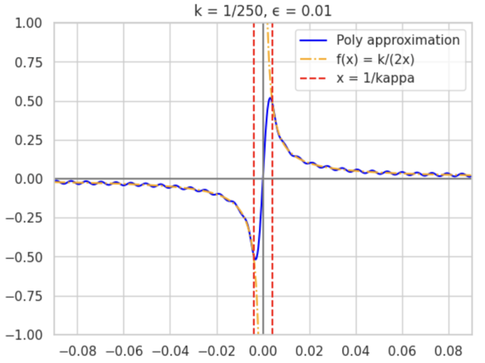

This dataset contains phase angles required to implement Quantum Signal Processing (QSP) and  Quantum Singular Value Transformation (QSVT) for approximating the function 1/x.

**Description of the dataset**

QSVT can be used for implementing polynomial transformations in quantum algorithms. This dataset provides phase angles to implement QSVT/QSP for  $f(x) = \frac{\kappa}{2x}$.

The generated polynomial is defined by a kappa ($\kappa$) and an epsilon ($\epsilon$) constant:
- **Kappa** represent the scaling factor that determines the interval in which the function is approximated.
- **Epsilon** represent the maximum error allowed in the polynomial approximation. ($\max_{x}|P(x)-f(x)|$)

This dataset was generated using numerical optimization techniques to find optimal phase angles that minimize the error in the polynomial approximation.

This dataset provides two types of data. First, it includes a polynomial $ P(x) $ that approximates the function $ f(x) = \frac{\kappa}{2x} $ over the interval $ [-1, -1/\kappa) \cup (1/\kappa, 1] $ with a maximum error of $ \epsilon $. In this dataset, $\kappa$ can take values from the set $\{1, 5, 50, 100, 250, 500, 1000, 1500\}$, and its choice depends on the specific interval in which we aim to approximate the function. 
The polynomial $ P(x) $ is expressed in the Chebyshev basis and can be accessed via `dataset.poly["chebyshev"]["0.01"]["100"]`, where "0.01" represents the $\epsilon$ value chosen and "100" the $\kappa$. This returns an array where, for example, $[1, 0, 2]$ corresponds to the polynomial $ 1 \cdot T_0(x) + 0 \cdot T_1(x) + 2 \cdot T_2(x) $, where $ T_n(x) $ denotes the $ n $-th Chebyshev polynomial.


On the other hand, the dataset provides the phase angles required for the QSP (or QSVT) subroutine via  `dataset.angles["qsp"]["0.01"]["100"]`

**Graphical Representation**

The following figure illustrates the polynomial approximation of $ f(x) = \frac{\kappa}{2x} $ with $ \kappa = 250 $ and $ \epsilon = 0.01 $:



The blue line represents the polynomial approximation, the orange dashed line corresponds to $ f(x) $, and the red dashed lines mark $ x = \pm 1/\kappa $. 


This dataset serves as a valuable resource for quantum algorithm researchers working with polynomial transformations and quantum signal processing techniques.


**Example usage**

In the following example we plot the output of the qsvt algorithm with different x-values to check the result polynomial we are applying.

```python
import pennylane as qml
import numpy as np
import matplotlib.pyplot as plt

[dataset] = qml.data.load("other", name="inverse")
angles_qsvt = dataset.angles["qsvt"]["0.01"]["100"] 

outputs_qsvt = []
points = np.arange(-1, 1, 1/300)

for x in points:

    # Encode x in the top left of the matrix
    block_encoding = qml.RX(2 * np.arccos(x), wires=0)
    projectors = [qml.PCPhase(angle, dim=1, wires=0) for angle in qsvt_angles]

    @qml.qnode(qml.device("default.qubit"))
    def circuit_qsvt():
        qml.QSVT(block_encoding, projectors)
        return qml.state()

    output = qml.matrix(circuit_qsvt, wire_order=[0])()[0, 0]

    outputs_qsvt.append(output.real)

plt.plot(points, outputs_qsvt)
plt.show()
```